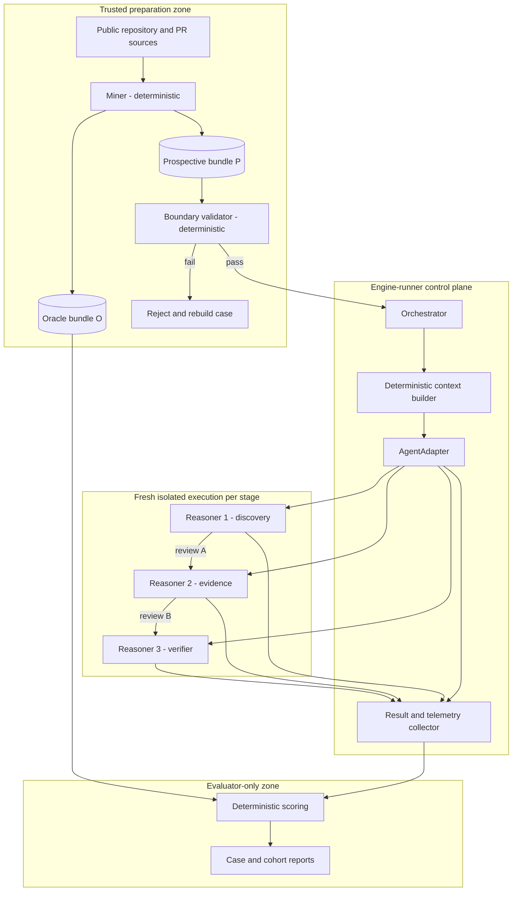

# End-to-End Code-Review Benchmark System Design

Status: Draft v0.1  
Last updated: 2026-09-06  
Canonical path: `/home/alex/repos/engine-runner/docs/system-design.md`

## 1. Purpose

This system measures the incremental engineering value of a staged LLM code-review pipeline over frozen public open-source changes. It separates prospective review evidence from retrospective evaluation evidence so that findings can be reproduced, compared, and audited without exposing benchmark answers to reviewers.

The MVP has two persistent coding roles and three isolated runtime reasoning roles:

| Role | Responsibility | Kind |
|---|---|---|
| `coder-miner` | Build and maintain the deterministic miner and export contract | Coding agent |
| `coder-engine-runner` | Build and maintain orchestration, adapters, isolation, validation, results, and scoring | Coding agent |
| `reasoner-1` | Discover plausible defects with high recall | Runtime reasoning agent |
| `reasoner-2` | Substantiate, narrow, or reject discovered findings | Runtime reasoning agent |
| `reasoner-3` | Adversarially verify the substantiated review | Runtime reasoning agent |

The three reasoners are fresh executions for every case. They are not persistent code owners. Initially, evaluation is deterministic software inside `engine-runner`; an LLM evaluator may be added later only in the evaluator-only trust zone.

## 2. Design principles

1. Evidence boundaries are enforced by software and filesystem isolation, not only by prompts.
2. Code, agent state, mined data, and build artifacts live in separate top-level directories.
3. Coding agents never need access to raw mined data, oracle data, or production benchmark results.
4. Reviewer-visible metadata is minimal and reconstructable at the cutoff.
5. Every prompt, model, budget, handoff rule, adapter version, schema, and stopping rule is versioned.
6. A cohort runs under a frozen protocol. Prompts are not tuned per case.
7. Vendor-specific behavior is hidden behind a small `AgentAdapter` contract.
8. The fixture agent is deterministic and is used to build and test the engine without invoking a real LLM.
9. Runtime stages use fresh OCI containers or equivalently isolated processes with explicit, read-only mounts.
10. Every result is attributable to exact inputs, configuration, executable versions, and attempts.

## 3. Host filesystem layout

The role comes before the provider in agent-state paths. This keeps a role stable if its implementation moves between Codex and Claude.

```text
/home/alex/
├── repos/
│   ├── miner/                       # coder-miner works directly here
│   └── engine-runner/               # coder-engine-runner works directly here
│       └── docs/
│           └── system-design.md     # this document
│
├── agents/
│   ├── coder-miner/                 # scratch, logs, provider config; no source code
│   │   ├── codex/
│   │   ├── claude/
│   │   ├── scratch/
│   │   └── logs/
│   ├── coder-engine-runner/
│   │   ├── codex/
│   │   ├── claude/
│   │   ├── scratch/
│   │   └── logs/
│   ├── reasoner-1/
│   │   ├── claude/
│   │   ├── scratch/
│   │   └── logs/
│   ├── reasoner-2/
│   │   ├── claude/
│   │   ├── scratch/
│   │   └── logs/
│   ├── reasoner-3/
│   │   ├── claude/
│   │   ├── scratch/
│   │   └── logs/
│   └── fixture-agent/               # optional runtime traces only; no implementation
│       ├── scratch/
│       └── logs/
│
├── data/
│   ├── raw/                         # trusted miner input; never mounted to coding agents
│   ├── cases/
│   │   └── <case-id>/
│   │       ├── prospective/         # reviewer-admissible bundle P
│   │       └── oracle/              # evaluator-only bundle O
│   └── results/
│       └── <run-id>/                # immutable run artifacts and scores
│
└── build/
    ├── bin/                         # generated executables
    ├── images/                      # OCI images and metadata
    └── cache/                       # disposable build cache
```

Rules:

- Git repositories exist only under `repos/`.
- Agent configuration, authentication, memory, logs, and scratch exist only under `agents/`.
- Agent directories must not contain source-code copies or Git repositories.
- Raw cases, prospective bundles, oracle bundles, and run results exist only under `data/`.
- Compiled binaries, container artifacts, and caches exist only under `build/`.
- `/home/alex/data` must not be registered as a coding project.
- Runtime containers receive stage-specific mounts, never the host's complete `agents/` or `data/` directory.

## 4. Source-control layout

### 4.1 Miner repository

```text
repos/miner/
├── cmd/
├── internal/
├── schemas/
│   ├── prospective-manifest.schema.json
│   ├── reviewer-metadata.schema.json
│   └── oracle-manifest.schema.json
├── testdata/                         # small synthetic fixtures only
├── docs/
│   └── export-contract.md
├── AGENTS.md
├── go.mod
└── README.md
```

### 4.2 Engine-runner repository

```text
repos/engine-runner/
├── cmd/
│   └── bench/
├── internal/
│   ├── orchestrator/
│   ├── runner/
│   ├── contextbuilder/
│   ├── boundaryvalidator/
│   ├── adapters/
│   │   ├── claude/
│   │   ├── codex/
│   │   └── fixture/
│   ├── results/
│   └── evaluation/
├── configs/
│   ├── agents/
│   │   ├── reasoner-1.yaml
│   │   ├── reasoner-2.yaml
│   │   └── reasoner-3.yaml
│   └── protocols/
│       └── pilot-v1.yaml
├── prompts/
│   └── pilot-v1/
│       ├── reasoner-1.md
│       ├── reasoner-2.md
│       └── reasoner-3.md
├── schemas/
│   ├── agent-request.schema.json
│   ├── review-a.schema.json
│   ├── review-b.schema.json
│   ├── review-c.schema.json
│   └── run-result.schema.json
├── fixtures/                         # deterministic synthetic inputs and responses
├── docs/
│   └── system-design.md
├── AGENTS.md
├── go.mod
└── README.md
```

Source control contains code, prompts, protocol manifests, schemas, documentation, and small synthetic fixtures. It must not contain credentials, agent memory, raw mined data, oracle data, production run logs, or unpublished benchmark results.

## 5. Logical architecture



The arrows between reasoners represent serialized, explicit handoff artifacts. They do not represent shared processes, shared home directories, or shared filesystems.

## 6. Component responsibilities

### 6.1 Miner

The miner is deterministic preparation software. It may access public retrospective sources inside the trusted preparation zone, but it must export prospective and oracle material into physically separate bundles.

Responsibilities:

- Resolve repository and change identity.
- Select and record the benchmark cutoff.
- Reconstruct reviewer-visible title and description as of the cutoff or omit them.
- Produce the admissible diff and sanitized repository snapshot.
- Remove later commits, branches, tags, reflogs, alternate object stores, and worktree links.
- Produce an engine-only manifest and reviewer-visible metadata separately.
- Produce a sealed evaluator-only oracle bundle.
- Generate checksums and schema versions.
- Use neutral case identifiers and filenames that do not reveal outcomes.

The miner does not invoke reviewers and does not score reviews.

### 6.2 Boundary validator

The boundary validator is deterministic software owned by `coder-engine-runner`. It is not `reasoner-3` and does not judge whether a review finding is correct.

Before any reviewer runs, it rejects a case when it detects:

- Unapproved files, paths, symlinks, sockets, or mounts.
- Git refs or objects beyond the cutoff's admissible history.
- Reflogs, remotes, alternates, submodule leakage, or worktree metadata.
- Forbidden metadata fields or values.
- Current or final PR state, later CI, reviews, comments, fixes, or regressions.
- Oracle-shaped filenames, labels, expected findings, or outcome hints.
- Manifest/checksum mismatches.
- Inputs that do not conform to the pinned schema version.

Its output is a machine-readable pass/fail report. A failed case never reaches a runtime reasoner.

### 6.3 Engine-runner

The engine-runner is deterministic orchestration software. It:

- Loads a versioned protocol.
- Validates the prospective bundle.
- Constructs the exact context for each stage.
- Creates a fresh isolated execution environment for each stage.
- Invokes the configured vendor through `AgentAdapter`.
- Validates structured agent output.
- Records inputs, outputs, timing, usage, tool calls, exit status, retries, and versions.
- Performs explicit handoffs between stages.
- Runs deterministic scoring with oracle access only after reviewer execution is complete.
- Writes immutable per-run results.

### 6.4 Runtime reasoning agents

#### Reasoner 1: discovery reviewer

- Receives prospective bundle P only.
- Reviews broadly with high recall.
- Produces hypotheses/findings with severity, confidence, evidence, and uncertainty.
- Cannot access prior reviews or oracle data.

#### Reasoner 2: evidence reviewer

- Receives the same prospective inputs as reasoner 1.
- Receives `review-a.json` only when the frozen protocol enables the A-to-B handoff. Pilot v1 enables this handoff.
- Builds exact causal chains from repository evidence.
- Confirms, narrows, rejects, or marks findings inconclusive.
- Proposes the smallest falsifier, validator, or test.

#### Reasoner 3: adversarial verifier

- Receives exactly the inputs visible to reasoner 2 plus `review-b.json`.
- Tries to falsify every B finding.
- Produces `CONFIRMED`, `NARROWED`, `REJECTED`, or `INCONCLUSIVE` dispositions.
- May search for new findings only near mechanisms entered while validating B.
- Does not access the retrospective oracle and is not the evaluator.

### 6.5 Evaluator

The evaluator runs after all reviewer stages. It may access P, A/B/C outputs, and O. The MVP evaluator is deterministic and computes configured metrics. A later LLM evaluator must run as a separate evaluator-only agent and must never share state or a filesystem with reasoners 1-3.

## 7. Prospective and oracle contracts

Each mined case has two physically separate roots.

```text
data/cases/<case-id>/
├── prospective/
│   ├── reviewer/
│   │   ├── repository/              # sanitized source snapshot
│   │   ├── diff.patch
│   │   └── metadata.json            # minimal reviewer-visible metadata
│   └── control/
│       ├── manifest.json             # engine-only routing and integrity data
│       └── checksums.sha256
└── oracle/
    ├── oracle.json
    ├── retrospective-evidence/
    └── checksums.sha256
```

Recommended reviewer-visible metadata:

```json
{
  "schema_version": "reviewer-metadata/v1",
  "repository": "owner/name",
  "title": "title exactly as known at cutoff",
  "description": "description exactly as known at cutoff",
  "cutoff_timestamp": "RFC3339 timestamp"
}
```

If a field cannot be reconstructed at or before the cutoff, the miner omits it. If removing a field does not materially impair competent review, it should not be reviewer-visible.

The control manifest may include case identifiers, cutoff/base/target object identifiers, checksums, snapshot format, and schema versions required by deterministic software. The context builder must not pass the control manifest wholesale to a reasoning agent.

Oracle data may include later fixes, regressions, current/final state, adjudicated findings, retrospective classifications, and evaluator evidence. It is mounted only for evaluation.

## 8. AgentAdapter contract

`AgentAdapter` provides vendor polymorphism without creating a generic memory system. Requests and results are explicit, immutable, per-stage records.

Illustrative Go interface:

```go
type AgentAdapter interface {
    Name() string
    Version(ctx context.Context) (string, error)
    Run(ctx context.Context, req RunRequest) (RunResult, error)
}

type RunRequest struct {
    RunID          string
    CaseID         string
    Stage          string
    WorkspacePath  string
    PromptPath     string
    OutputSchema   string
    Model          string
    ReasoningLevel string
    Budget         Budget
    Environment    map[string]string
}

type RunResult struct {
    OutputPath string
    ExitCode   int
    StartedAt  time.Time
    FinishedAt time.Time
    Usage      Usage
    ToolCalls  int
    Adapter    string
    Version    string
    Attempt    int
}
```

Initial implementations:

- `ClaudeAdapter`: invokes Claude through its supported non-interactive interface and normalizes output and telemetry.
- `CodexAdapter`: invokes Codex through its supported non-interactive interface and normalizes output and telemetry.
- `FixtureAdapter`: returns versioned prerecorded responses and controlled failures without network access or LLM execution.

The interface does not share conversation memory between vendors. Cross-stage knowledge is transferred only through declared files such as `review-a.json` and `review-b.json`.

### 8.1 Fixture agent

The fixture agent is the deterministic test implementation behind `FixtureAdapter`. It is professional test infrastructure, not a fake reviewer and not a fourth reasoning role.

It supports:

- Successful A/B/C responses.
- Invalid JSON and schema violations.
- Timeout, cancellation, non-zero exit, and partial output.
- Usage and cost fixtures.
- Retry/idempotency verification.
- Assertions that each stage sees only its allowed mounts and handoff files.
- End-to-end engine tests without credentials, network access, or benchmark data.

Fixture definitions live in `repos/engine-runner/fixtures/`. Only optional runtime logs and scratch live in `agents/fixture-agent/`.

## 9. Isolation model

Each reasoner stage runs in a fresh OCI container or an equivalently isolated execution environment. Docker or Podman may provide the OCI runtime; Kubernetes is not required for the MVP.

Minimum controls:

- Network disabled unless a vendor invocation specifically requires controlled egress.
- Fresh process, workspace, temporary directory, and home directory per stage.
- Read-only mount of the explicit reviewer input directory.
- Read-only mount of the stage prompt and enabled handoff files.
- Separate writable output directory containing no other stage's private files.
- No mount of `/home/alex`, `repos/`, `agents/`, `data/`, Docker socket, SSH agent, or host Git configuration.
- Credentials injected as scoped secrets, never copied into the workspace or result bundle.
- CPU, memory, wall-time, output-size, and tool-call limits.
- No reuse of vendor conversation IDs across cases, stages, or benchmark variants.
- Captured container image digest and adapter version.

## 10. Execution lifecycle

1. Miner ingests a selected public change and determines the cutoff.
2. Miner emits P and sealed O into separate directories.
3. Boundary validator verifies P and writes a validation report.
4. Orchestrator freezes the run manifest and configuration fingerprints.
5. Context builder prepares reasoner 1 inputs; runner executes it in a fresh environment.
6. Engine validates and stores `review-a.json`.
7. Context builder prepares reasoner 2 inputs and the protocol-authorized A handoff; runner uses another fresh environment.
8. Engine validates and stores `review-b.json`.
9. Context builder prepares reasoner 3 inputs and B handoff; runner uses another fresh environment.
10. Engine validates and stores `review-c.json`.
11. Only after reviewer execution, evaluator receives the oracle mount and scores the run.
12. Engine seals results with hashes, versions, timestamps, usage, cost, and attempt history.

No stage reads a predecessor's workspace. Handoffs are serialized, schema-validated files copied by the orchestrator.

## 11. Results

```text
data/results/<run-id>/
├── run.json                          # protocol, model, adapter and input fingerprints
├── boundary-validation.json
├── stages/
│   ├── reasoner-1/
│   │   ├── request.json
│   │   ├── review-a.json
│   │   └── telemetry.json
│   ├── reasoner-2/
│   │   ├── request.json
│   │   ├── review-b.json
│   │   └── telemetry.json
│   └── reasoner-3/
│       ├── request.json
│       ├── review-c.json
│       └── telemetry.json
├── evaluation/
│   ├── scores.json
│   └── findings.json
├── events.jsonl
└── checksums.sha256
```

Record at least:

- Input and output tokens.
- Tool calls and wall-clock duration.
- Vendor-reported and normalized cost.
- Findings proposed, strengthened, narrowed, rejected, or newly discovered.
- Final true positives and false positives reaching humans.
- Cost per validated material finding.
- Cost per false positive eliminated.
- Incremental value and incremental cost of each stage.
- Every attempt, including failed or retried attempts.

Production results remain outside Git. Curated, sanitized aggregate reports may be published separately after contamination review.

## 12. Failure and reproducibility rules

- Never silently retry. Record the failed attempt and the retry policy decision.
- Treat invalid structured output as an explicit stage failure unless the frozen protocol defines one repair attempt.
- A boundary-validation failure invalidates the case before LLM cost is incurred.
- A contamination report during a reasoning stage invalidates that run for clean benchmark evidence.
- Pin protocol version, prompt hashes, schemas, model names, adapter versions, executable versions, container digests, and input checksums.
- Preserve stdout/stderr only after secret redaction and size limits.
- Generate stable run and case identifiers that do not encode benchmark outcomes.

## 13. Access matrix

| Actor | Source repo | Synthetic fixtures | Raw data | Prospective P | Oracle O | Results |
|---|---:|---:|---:|---:|---:|---:|
| `coder-miner` | Miner RW | RW | No | No production access | No | No |
| `coder-engine-runner` | Engine-runner RW | RW | No | No production access | No | No production access |
| Miner runtime | Miner executable RO | Optional | RO | Write | Write | No |
| Boundary validator | Engine executable RO | Optional | No | RO | No | Write validation only |
| `reasoner-1` | No | No | No | Stage-specific RO | No | Own output only |
| `reasoner-2` | No | No | No | Stage-specific RO + authorized A | No | Own output only |
| `reasoner-3` | No | No | No | Same as B + B output | No | Own output only |
| Evaluator | Engine executable RO | Optional | No | RO | RO | Write evaluation only |
| Fixture agent | No | RO | No | Synthetic only | Synthetic only | Test output only |

Access is enforced with Unix ownership/permissions, runner mount allowlists, and container isolation. Prompt instructions are a secondary safeguard.

## 14. Claude bootstrap and implementation assignment

Claude Code is the selected implementation provider, not an additional architectural role. It first runs once as a temporary bootstrap agent and then runs as two separately scoped coding-agent sessions. The bootstrap session ends after it creates and verifies the role boundaries; it must not become a shared memory layer between the coding agents.

### 14.1 Coding-agent bootstrap

The temporary Claude bootstrap agent is responsible for:

1. Creating the state directories for `coder-miner` and `coder-engine-runner` under `/home/alex/agents/`.
2. Creating the state directories for `reasoner-1`, `reasoner-2`, `reasoner-3`, and `fixture-agent`.
3. Creating role-specific launch configuration so each coding session has its own Claude configuration, scratch, logs, working directory, and permission boundary.
4. Creating source-controlled `AGENTS.md` and `CLAUDE.md` instructions in each code repository.
5. Ensuring `coder-miner` can work only in `/home/alex/repos/miner` and `coder-engine-runner` only in `/home/alex/repos/engine-runner` during normal coding work.
6. Ensuring no source code or Git repository is created under `/home/alex/agents`.
7. Ensuring neither coding role can access `/home/alex/data` during implementation.
8. Verifying the layout and permissions without copying credentials or prior conversation history between roles.

After bootstrap, Claude starts two independent coding sessions:

- Claude as `coder-miner`, with state under `/home/alex/agents/coder-miner/claude` and working directory `/home/alex/repos/miner`.
- Claude as `coder-engine-runner`, with state under `/home/alex/agents/coder-engine-runner/claude` and working directory `/home/alex/repos/engine-runner`.

These sessions may use the same vendor account, but they must not share session history, scratch files, logs, mutable memory, or broad filesystem access.

### 14.2 Runtime-agent and adapter implementation

Claude operating as `coder-engine-runner` is responsible for:

1. Creating versioned manifests and prompts for `reasoner-1`, `reasoner-2`, and `reasoner-3`.
2. Creating their JSON output schemas and validation tests.
3. Implementing the Go `AgentAdapter` interface.
4. Implementing `FixtureAdapter` and fixture-agent scenarios first.
5. Implementing `ClaudeAdapter` and `CodexAdapter` without shared vendor memory.
6. Implementing deterministic stage-context construction and explicit A/B handoffs.
7. Implementing isolation tests proving that forbidden paths and files are unavailable.
8. Recording normalized telemetry without exposing credentials or hidden vendor state.

Claude must not:

- Read `/home/alex/data` or use a real mined case while building the runtime layer.
- Place code, prompts, schemas, or fixtures under `/home/alex/agents`.
- implement a cross-provider memory store.
- Reuse conversations between stages.
- Change prompts during a frozen cohort without creating a new protocol version.
- Add oracle access to any adapter or reasoner.

The first implementation loop uses only the fixture agent. Real Claude and Codex invocations are enabled only after the fixture pipeline, schema validation, isolation tests, and result sealing pass.

## 15. MVP milestones

### Milestone 1: deterministic vertical slice

- Initialize the Go `engine-runner` repository.
- Commit this design and an `AGENTS.md` containing the access boundaries.
- Implement protocol loading and validation.
- Implement `AgentAdapter` and `FixtureAdapter`.
- Add synthetic P/O fixtures with no mined data.
- Run reasoners 1-3 through fixture responses and explicit handoffs.
- Validate structured outputs and write the complete result tree.
- Run every stage in an OCI container with explicit mounts and network disabled.

Exit criterion: one command produces a reproducible, checksummed A/B/C/evaluation result from synthetic inputs without vendor credentials.

### Milestone 2: real vendor adapters

- Implement and test `ClaudeAdapter`.
- Implement and test `CodexAdapter`.
- Capture versions, usage, cost, tool calls, timeouts, and cancellation.
- Prove that swapping providers requires configuration changes only.

Exit criterion: the same synthetic case and reasoner definition run through either vendor with the same request/result contract.

### Milestone 3: miner integration

- Freeze `miner/docs/export-contract.md` and schemas.
- Consume one sanitized miner-produced prospective bundle.
- Run boundary validation before any reviewer.
- Keep oracle physically unavailable until evaluation.

Exit criterion: a mined case completes without contamination and with full provenance.

### Milestone 4: fixed pilot cohort

- Freeze pilot-v1 prompts, models, budgets, adapters, and stopping rules.
- Run 5-10 cases without per-case prompt tuning.
- Produce per-case and cohort-level incremental-value reports.

Exit criterion: results distinguish review discovery, substantiation, verification, false-positive suppression, and cost per incremental benefit.

## 16. Deferred decisions

- Exact sanitized repository representation: source archive versus pruned Git bundle.
- Exact vendor authentication method for non-interactive runs.
- Whether controlled egress is provided by a host-side adapter proxy or a tightly allowlisted container network.
- Long-term result publication and signing mechanism.
- Whether evaluation later gains a separately governed LLM judge.
- When validator or evaluator code becomes large enough to justify separate repositories and coding agents.

These decisions must not weaken the core boundary: reasoning agents never see retrospective oracle information, and coding-agent convenience never grants access to production benchmark data.
